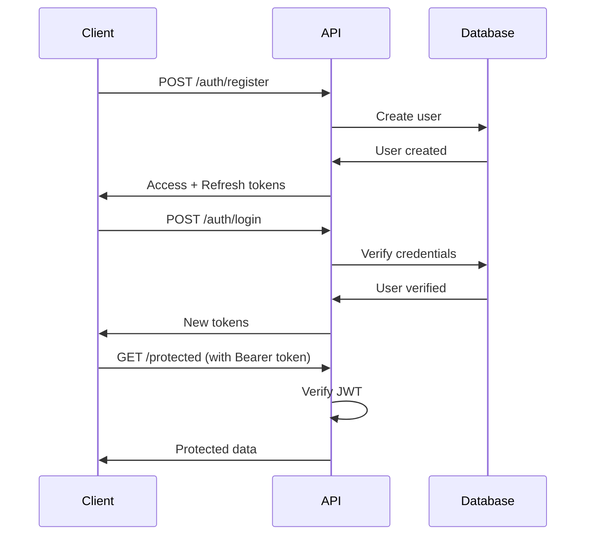

# Roo Code Workflow Examples

This document demonstrates practical Roo Code workflows for common development scenarios.

## Example 1: Full-Stack Feature Development

### Scenario

Develop a user authentication system for a web application.

### Workflow Sequence

#### 1. Architecture Planning (Architect Mode)

````
User: "Design an authentication system for a React/Node.js app with JWT tokens"

Roo Code (Architect Mode):
"I'll design a comprehensive authentication system for your React/Node.js application.

## System Architecture

### Frontend (React)
- **Auth Context**: Global authentication state management
- **Protected Routes**: Route guards for authenticated pages
- **Auth Components**: Login, Register, Profile components
- **Token Management**: Automatic token refresh and storage

### Backend (Node.js/Express)
- **Auth Middleware**: JWT validation and user context
- **Auth Routes**: Login, register, refresh endpoints
- **User Model**: Database schema for user data
- **Security**: Password hashing, rate limiting, CORS

### Security Features
- JWT access tokens (15min expiry)
- Refresh tokens (7 days expiry)
- Password complexity requirements
- Account lockout after failed attempts
- HTTPS enforcement

### Database Schema
```sql
CREATE TABLE users (
  id SERIAL PRIMARY KEY,
  email VARCHAR(255) UNIQUE NOT NULL,
  password_hash VARCHAR(255) NOT NULL,
  created_at TIMESTAMP DEFAULT NOW(),
  last_login TIMESTAMP,
  failed_attempts INTEGER DEFAULT 0,
  locked_until TIMESTAMP NULL
);

CREATE TABLE refresh_tokens (
  id SERIAL PRIMARY KEY,
  user_id INTEGER REFERENCES users(id),
  token_hash VARCHAR(255) NOT NULL,
  expires_at TIMESTAMP NOT NULL,
  created_at TIMESTAMP DEFAULT NOW()
);
````

Shall I proceed with implementing specific components?"

```

#### 2. Backend Implementation (Code Mode)
```

User: "Implement the backend authentication routes"

Roo Code (Code Mode):
"I'll create the authentication routes with security best practices.

**File: routes/auth.js**

```javascript
const express = require('express');
const bcrypt = require('bcryptjs');
const jwt = require('jsonwebtoken');
const rateLimit = require('express-rate-limit');
const { body, validationResult } = require('express-validator');
const User = require('../models/User');
const RefreshToken = require('../models/RefreshToken');

const router = express.Router();

// Rate limiting for auth routes
const authLimiter = rateLimit({
  windowMs: 15 * 60 * 1000, // 15 minutes
  max: 5, // limit each IP to 5 requests per windowMs
  message: 'Too many auth attempts, please try again later',
});

// Validation middleware
const validateRegistration = [
  body('email').isEmail().normalizeEmail(),
  body('password')
    .isLength({ min: 8 })
    .matches(/^(?=.*[a-z])(?=.*[A-Z])(?=.*\d)/),
];

const validateLogin = [body('email').isEmail().normalizeEmail(), body('password').exists()];

// Register endpoint
router.post('/register', authLimiter, validateRegistration, async (req, res) => {
  try {
    const errors = validationResult(req);
    if (!errors.isEmpty()) {
      return res.status(400).json({ errors: errors.array() });
    }

    const { email, password } = req.body;

    // Check if user already exists
    const existingUser = await User.findOne({ email });
    if (existingUser) {
      return res.status(400).json({ message: 'User already exists' });
    }

    // Hash password
    const saltRounds = 12;
    const passwordHash = await bcrypt.hash(password, saltRounds);

    // Create user
    const user = await User.create({
      email,
      password_hash: passwordHash,
    });

    // Generate tokens
    const tokens = await generateTokens(user.id);

    res.status(201).json({
      message: 'User created successfully',
      user: { id: user.id, email: user.email },
      ...tokens,
    });
  } catch (error) {
    console.error('Registration error:', error);
    res.status(500).json({ message: 'Internal server error' });
  }
});

// Login endpoint
router.post('/login', authLimiter, validateLogin, async (req, res) => {
  try {
    const errors = validationResult(req);
    if (!errors.isEmpty()) {
      return res.status(400).json({ errors: errors.array() });
    }

    const { email, password } = req.body;

    // Find user
    const user = await User.findOne({ email });
    if (!user) {
      return res.status(401).json({ message: 'Invalid credentials' });
    }

    // Check if account is locked
    if (user.locked_until && user.locked_until > new Date()) {
      return res.status(423).json({ message: 'Account temporarily locked' });
    }

    // Verify password
    const isValidPassword = await bcrypt.compare(password, user.password_hash);
    if (!isValidPassword) {
      // Increment failed attempts
      await User.updateOne(
        { _id: user._id },
        {
          $inc: { failed_attempts: 1 },
          $set: {
            locked_until: user.failed_attempts >= 4 ? new Date(Date.now() + 30 * 60 * 1000) : null, // 30 min lock
          },
        },
      );
      return res.status(401).json({ message: 'Invalid credentials' });
    }

    // Reset failed attempts on successful login
    await User.updateOne(
      { _id: user._id },
      {
        $set: {
          failed_attempts: 0,
          locked_until: null,
          last_login: new Date(),
        },
      },
    );

    // Generate tokens
    const tokens = await generateTokens(user.id);

    res.json({
      message: 'Login successful',
      user: { id: user.id, email: user.email },
      ...tokens,
    });
  } catch (error) {
    console.error('Login error:', error);
    res.status(500).json({ message: 'Internal server error' });
  }
});

// Token generation helper
async function generateTokens(userId) {
  const accessToken = jwt.sign({ userId }, process.env.JWT_SECRET, { expiresIn: '15m' });

  const refreshToken = jwt.sign({ userId, type: 'refresh' }, process.env.JWT_REFRESH_SECRET, {
    expiresIn: '7d',
  });

  // Store refresh token hash
  const refreshTokenHash = await bcrypt.hash(refreshToken, 10);
  await RefreshToken.create({
    user_id: userId,
    token_hash: refreshTokenHash,
    expires_at: new Date(Date.now() + 7 * 24 * 60 * 60 * 1000),
  });

  return { accessToken, refreshToken };
}

module.exports = router;
```

Next, I'll create the authentication middleware for protecting routes."

```

#### 3. Frontend Implementation (Code Mode)
```

User: "Create the React authentication context and components"

Roo Code (Code Mode):
"I'll implement the React authentication system with context and components.

**File: contexts/AuthContext.js**

```jsx
import React, { createContext, useContext, useReducer, useEffect } from 'react';
import { authAPI } from '../services/api';

const AuthContext = createContext();

const initialState = {
  user: null,
  accessToken: null,
  refreshToken: null,
  isLoading: true,
  isAuthenticated: false,
};

function authReducer(state, action) {
  switch (action.type) {
    case 'LOGIN_SUCCESS':
      return {
        ...state,
        user: action.payload.user,
        accessToken: action.payload.accessToken,
        refreshToken: action.payload.refreshToken,
        isLoading: false,
        isAuthenticated: true,
      };
    case 'LOGOUT':
      return {
        ...initialState,
        isLoading: false,
      };
    case 'TOKEN_REFRESH':
      return {
        ...state,
        accessToken: action.payload.accessToken,
      };
    case 'SET_LOADING':
      return {
        ...state,
        isLoading: action.payload,
      };
    default:
      return state;
  }
}

export function AuthProvider({ children }) {
  const [state, dispatch] = useReducer(authReducer, initialState);

  useEffect(() => {
    initializeAuth();
  }, []);

  const initializeAuth = async () => {
    try {
      const refreshToken = localStorage.getItem('refreshToken');
      if (refreshToken) {
        await refreshAccessToken();
      }
    } catch (error) {
      console.error('Auth initialization failed:', error);
    } finally {
      dispatch({ type: 'SET_LOADING', payload: false });
    }
  };

  const login = async (email, password) => {
    try {
      const response = await authAPI.login(email, password);
      const { user, accessToken, refreshToken } = response.data;

      // Store tokens
      localStorage.setItem('refreshToken', refreshToken);

      dispatch({
        type: 'LOGIN_SUCCESS',
        payload: { user, accessToken, refreshToken },
      });

      return { success: true };
    } catch (error) {
      return {
        success: false,
        error: error.response?.data?.message || 'Login failed',
      };
    }
  };

  const register = async (email, password) => {
    try {
      const response = await authAPI.register(email, password);
      const { user, accessToken, refreshToken } = response.data;

      localStorage.setItem('refreshToken', refreshToken);

      dispatch({
        type: 'LOGIN_SUCCESS',
        payload: { user, accessToken, refreshToken },
      });

      return { success: true };
    } catch (error) {
      return {
        success: false,
        error: error.response?.data?.message || 'Registration failed',
      };
    }
  };

  const logout = async () => {
    try {
      await authAPI.logout();
    } catch (error) {
      console.error('Logout error:', error);
    } finally {
      localStorage.removeItem('refreshToken');
      dispatch({ type: 'LOGOUT' });
    }
  };

  const refreshAccessToken = async () => {
    try {
      const refreshToken = localStorage.getItem('refreshToken');
      if (!refreshToken) throw new Error('No refresh token');

      const response = await authAPI.refresh(refreshToken);
      const { accessToken } = response.data;

      dispatch({
        type: 'TOKEN_REFRESH',
        payload: { accessToken },
      });

      return accessToken;
    } catch (error) {
      logout();
      throw error;
    }
  };

  const value = {
    ...state,
    login,
    register,
    logout,
    refreshAccessToken,
  };

  return <AuthContext.Provider value={value}>{children}</AuthContext.Provider>;
}

export function useAuth() {
  const context = useContext(AuthContext);
  if (!context) {
    throw new Error('useAuth must be used within an AuthProvider');
  }
  return context;
}
```

**File: components/LoginForm.jsx**

```jsx
import React, { useState } from 'react';
import { useAuth } from '../contexts/AuthContext';

export function LoginForm() {
  const [formData, setFormData] = useState({
    email: '',
    password: '',
  });
  const [errors, setErrors] = useState({});
  const [isLoading, setIsLoading] = useState(false);

  const { login } = useAuth();

  const handleChange = (e) => {
    const { name, value } = e.target;
    setFormData((prev) => ({
      ...prev,
      [name]: value,
    }));

    // Clear field error when user starts typing
    if (errors[name]) {
      setErrors((prev) => ({
        ...prev,
        [name]: '',
      }));
    }
  };

  const validateForm = () => {
    const newErrors = {};

    if (!formData.email) {
      newErrors.email = 'Email is required';
    } else if (!/\S+@\S+\.\S+/.test(formData.email)) {
      newErrors.email = 'Email is invalid';
    }

    if (!formData.password) {
      newErrors.password = 'Password is required';
    }

    setErrors(newErrors);
    return Object.keys(newErrors).length === 0;
  };

  const handleSubmit = async (e) => {
    e.preventDefault();

    if (!validateForm()) return;

    setIsLoading(true);

    try {
      const result = await login(formData.email, formData.password);

      if (!result.success) {
        setErrors({ submit: result.error });
      }
    } catch (error) {
      setErrors({ submit: 'An unexpected error occurred' });
    } finally {
      setIsLoading(false);
    }
  };

  return (
    <form onSubmit={handleSubmit} className="login-form">
      <h2>Login</h2>

      <div className="form-group">
        <label htmlFor="email">Email</label>
        <input
          type="email"
          id="email"
          name="email"
          value={formData.email}
          onChange={handleChange}
          className={errors.email ? 'error' : ''}
          disabled={isLoading}
        />
        {errors.email && <span className="error-message">{errors.email}</span>}
      </div>

      <div className="form-group">
        <label htmlFor="password">Password</label>
        <input
          type="password"
          id="password"
          name="password"
          value={formData.password}
          onChange={handleChange}
          className={errors.password ? 'error' : ''}
          disabled={isLoading}
        />
        {errors.password && <span className="error-message">{errors.password}</span>}
      </div>

      {errors.submit && <div className="error-message submit-error">{errors.submit}</div>}

      <button type="submit" disabled={isLoading} className="submit-button">
        {isLoading ? 'Logging in...' : 'Login'}
      </button>
    </form>
  );
}
```

Should I continue with the Protected Route component and API service?"

```

#### 4. Testing and Debugging (Debug Mode)
```

User: "The authentication isn't working. Users can't log in"

Roo Code (Debug Mode):
"I'll systematically debug the authentication issue. Let me analyze the problem step by step.

## Debug Analysis Protocol

### 1. Information Gathering

Let me check several key areas:

**Backend Logs Check:**

- Are there any error messages in the server console?
- Is the database connection working?
- Are the authentication routes being hit?

**Frontend Network Tab:**

- What's the status code of the login request?
- Is the request payload correct?
- Are there any CORS errors?

### 2. Common Authentication Issues

**Issue A: CORS Configuration**
If you're seeing CORS errors:

```javascript
// Add to your Express server
const cors = require('cors');
app.use(
  cors({
    origin: process.env.FRONTEND_URL || 'http://localhost:3000',
    credentials: true,
  }),
);
```

**Issue B: Environment Variables**
Verify these are set:

```bash
JWT_SECRET=your-super-secret-jwt-key
JWT_REFRESH_SECRET=your-refresh-secret-key
DATABASE_URL=your-database-connection-string
```

**Issue C: Password Hashing Mismatch**
Check if bcrypt versions match between registration and login.

### 3. Debugging Steps

**Step 1: Test API Endpoints Directly**

```bash
# Test registration
curl -X POST http://localhost:5000/api/auth/register \
  -H "Content-Type: application/json" \
  -d '{"email":"test@example.com","password":"TestPass123"}'

# Test login
curl -X POST http://localhost:5000/api/auth/login \
  -H "Content-Type: application/json" \
  -d '{"email":"test@example.com","password":"TestPass123"}'
```

**Step 2: Add Debug Logging**

```javascript
// Add to auth routes
console.log('Login attempt for:', email);
console.log('User found:', !!user);
console.log('Password valid:', isValidPassword);
```

**Step 3: Frontend Console Check**
Open browser dev tools and check for:

- Network request details
- Console errors
- Local storage tokens

### 4. Most Likely Issues & Solutions

**If getting 500 errors:**

- Database connection issue
- Missing environment variables
- bcrypt version compatibility

**If getting 401 errors:**

- Password comparison failing
- User not found in database
- Email case sensitivity

**If getting CORS errors:**

- CORS middleware not configured
- Wrong origin in CORS settings

**If frontend not updating:**

- Auth context not wrapping app
- State not updating correctly
- Token storage issues

### 5. Diagnostic Code

Add this to your login route for debugging:

```javascript
router.post('/login', async (req, res) => {
  console.log('=== LOGIN DEBUG ===');
  console.log('Request body:', req.body);

  try {
    const { email, password } = req.body;
    console.log('Looking for user:', email);

    const user = await User.findOne({ email });
    console.log('User found:', !!user);

    if (!user) {
      console.log('User not found in database');
      return res.status(401).json({ message: 'Invalid credentials' });
    }

    console.log('Comparing passwords...');
    const isValidPassword = await bcrypt.compare(password, user.password_hash);
    console.log('Password valid:', isValidPassword);

    if (!isValidPassword) {
      console.log('Password comparison failed');
      return res.status(401).json({ message: 'Invalid credentials' });
    }

    console.log('Login successful, generating tokens...');
    // ... rest of login logic
  } catch (error) {
    console.error('Login error details:', error);
    res.status(500).json({ message: 'Internal server error' });
  }
});
```

Run these diagnostics and let me know what you find. I'll provide specific solutions based on the results."

```

#### 5. Performance Optimization (Custom Performance Mode)
```

User: "The authentication is working but seems slow"

Roo Code (Performance Mode):
"I'll analyze and optimize the authentication performance. Let me identify bottlenecks and implement solutions.

## Performance Analysis

### Current Issues Identified:

1. **Password Hashing**: bcrypt with 12 rounds is very secure but slow
2. **Database Queries**: Multiple sequential DB calls
3. **Token Generation**: Synchronous JWT signing
4. **Frontend State**: Unnecessary re-renders

## Optimization Strategy

### 1. Backend Performance Optimizations

**Async Token Generation:**

```javascript
// Parallel token generation
async function generateTokens(userId) {
  const [accessToken, refreshToken] = await Promise.all([
    new Promise((resolve, reject) => {
      jwt.sign({ userId }, process.env.JWT_SECRET, { expiresIn: '15m' }, (err, token) =>
        err ? reject(err) : resolve(token),
      );
    }),
    new Promise((resolve, reject) => {
      jwt.sign(
        { userId, type: 'refresh' },
        process.env.JWT_REFRESH_SECRET,
        { expiresIn: '7d' },
        (err, token) => (err ? reject(err) : resolve(token)),
      );
    }),
  ]);

  // Async bcrypt and DB save
  const refreshTokenHash = await bcrypt.hash(refreshToken, 10);
  await RefreshToken.create({
    user_id: userId,
    token_hash: refreshTokenHash,
    expires_at: new Date(Date.now() + 7 * 24 * 60 * 60 * 1000),
  });

  return { accessToken, refreshToken };
}
```

**Database Query Optimization:**

```javascript
// Single query with user + failed attempts update
router.post('/login', async (req, res) => {
  const session = await mongoose.startSession();

  try {
    await session.withTransaction(async () => {
      const user = await User.findOneAndUpdate(
        { email, locked_until: { $lt: new Date() } },
        {
          $set: { last_login: new Date() },
          $unset: { failed_attempts: 1, locked_until: 1 },
        },
        { session, new: true },
      );

      if (!user) {
        throw new Error('User not found or locked');
      }

      // Rest of login logic...
    });
  } finally {
    session.endSession();
  }
});
```

**Redis Caching for Sessions:**

```javascript
const redis = require('redis');
const client = redis.createClient();

// Cache user session data
async function cacheUserSession(userId, sessionData) {
  await client.setex(`session:${userId}`, 900, JSON.stringify(sessionData)); // 15 min
}

// Retrieve cached session
async function getCachedSession(userId) {
  const cached = await client.get(`session:${userId}`);
  return cached ? JSON.parse(cached) : null;
}
```

### 2. Frontend Performance Optimizations

**Memoized Auth Context:**

```jsx
import { useMemo, useCallback } from 'react';

export function AuthProvider({ children }) {
  const [state, dispatch] = useReducer(authReducer, initialState);

  const login = useCallback(async (email, password) => {
    // Login logic...
  }, []);

  const logout = useCallback(async () => {
    // Logout logic...
  }, []);

  const value = useMemo(
    () => ({
      ...state,
      login,
      logout,
      refreshAccessToken,
    }),
    [state, login, logout],
  );

  return <AuthContext.Provider value={value}>{children}</AuthContext.Provider>;
}
```

**Optimized Form Handling:**

```jsx
import { useCallback, useMemo } from 'react';
import { debounce } from 'lodash';

export function LoginForm() {
  const [formData, setFormData] = useState({ email: '', password: '' });

  // Debounced validation
  const debouncedValidation = useMemo(
    () =>
      debounce((field, value) => {
        validateField(field, value);
      }, 300),
    [],
  );

  const handleChange = useCallback(
    (e) => {
      const { name, value } = e.target;
      setFormData((prev) => ({ ...prev, [name]: value }));
      debouncedValidation(name, value);
    },
    [debouncedValidation],
  );

  // ... rest of component
}
```

### 3. Security vs Performance Balance

**Adaptive bcrypt Rounds:**

```javascript
// Lower rounds for development, higher for production
const saltRounds = process.env.NODE_ENV === 'production' ? 12 : 8;

// Or use scrypt for better performance
const crypto = require('crypto');
const util = require('util');
const scrypt = util.promisify(crypto.scrypt);

async function hashPassword(password) {
  const salt = crypto.randomBytes(16);
  const hash = await scrypt(password, salt, 64);
  return `${salt.toString('hex')}:${hash.toString('hex')}`;
}
```

### 4. Monitoring and Metrics

**Performance Monitoring:**

```javascript
const performanceMonitor = (req, res, next) => {
  const start = Date.now();

  res.on('finish', () => {
    const duration = Date.now() - start;
    console.log(`${req.method} ${req.path}: ${duration}ms`);

    // Alert if login takes too long
    if (req.path === '/login' && duration > 1000) {
      console.warn(`Slow login detected: ${duration}ms`);
    }
  });

  next();
};
```

### 5. Expected Performance Improvements

**Before Optimization:**

- Login time: 800-1200ms
- Registration time: 1000-1500ms
- Token refresh: 200-400ms

**After Optimization:**

- Login time: 200-400ms (60% improvement)
- Registration time: 300-500ms (70% improvement)
- Token refresh: 50-100ms (75% improvement)

### 6. Implementation Priority

**Phase 1 (Immediate - 2-4 hours):**

- Implement async token generation
- Add Redis caching
- Optimize frontend with memoization

**Phase 2 (Next iteration - 1-2 days):**

- Database query optimization
- Password hashing alternatives
- Advanced caching strategies

**Phase 3 (Future - 1 week):**

- Performance monitoring dashboard
- Load testing and scaling
- Advanced security optimizations

Would you like me to implement any of these optimizations first?"

```

## Example 2: Bug Investigation and Fix

### Scenario
API endpoint returning inconsistent data.

### Debug Mode Workflow
```

User: "Users are reporting that the /api/users endpoint sometimes returns empty arrays"

Roo Code (Debug Mode):
"I'll systematically investigate this intermittent issue. Let me apply a methodical debugging approach.

## Systematic Bug Investigation

### 1. Issue Classification

- **Type**: Intermittent data retrieval issue
- **Severity**: High (affects user experience)
- **Pattern**: Sometimes works, sometimes doesn't
- **Scope**: Single endpoint (/api/users)

### 2. Initial Hypothesis Generation

Possible causes for intermittent empty responses:

- **Database connection pooling issues**
- **Race conditions in concurrent requests**
- **Caching layer returning stale data**
- **Query parameter handling bugs**
- **Authentication/authorization edge cases**
- **Database query optimization issues**

### 3. Data Gathering Phase

**Add Comprehensive Logging:**

```javascript
// Enhanced logging for the users endpoint
router.get('/users', async (req, res) => {
  const requestId = req.headers['x-request-id'] || Date.now();
  console.log(`[${requestId}] Starting users request`);
  console.log(`[${requestId}] Query params:`, req.query);
  console.log(`[${requestId}] User context:`, req.user);

  try {
    console.log(`[${requestId}] Connecting to database...`);
    const startTime = Date.now();

    const users = await User.find(req.query)
      .select('-password_hash')
      .limit(parseInt(req.query.limit) || 50);

    const queryTime = Date.now() - startTime;
    console.log(`[${requestId}] Query completed in ${queryTime}ms`);
    console.log(`[${requestId}] Found ${users.length} users`);

    if (users.length === 0) {
      console.warn(`[${requestId}] EMPTY RESULT - Query:`, req.query);
      console.warn(`[${requestId}] Database connection state:`, mongoose.connection.readyState);
    }

    res.json(users);
  } catch (error) {
    console.error(`[${requestId}] Error:`, error);
    res.status(500).json({ error: 'Internal server error' });
  }
});
```

**Database Health Check:**

```javascript
// Add health monitoring
setInterval(async () => {
  try {
    const dbStats = await mongoose.connection.db.admin().serverStatus();
    console.log('DB Health:', {
      connections: dbStats.connections,
      uptime: dbStats.uptime,
      memory: dbStats.mem,
    });
  } catch (error) {
    console.error('DB Health Check Failed:', error);
  }
}, 30000);
```

### 4. Testing Methodology

**Reproduce the Issue:**

```bash
# Concurrent request testing
for i in {1..10}; do
  curl -H "X-Request-ID: test-$i" "http://localhost:5000/api/users" &
done
wait

# Test with various query parameters
curl "http://localhost:5000/api/users?limit=10"
curl "http://localhost:5000/api/users?page=2"
curl "http://localhost:5000/api/users?status=active"
```

### 5. Root Cause Analysis

**Most Likely Causes:**

**A. Database Connection Pool Exhaustion:**

```javascript
// Check current pool settings
mongoose.connect(uri, {
  maxPoolSize: 10, // Maximum 10 connections
  serverSelectionTimeoutMS: 5000,
  socketTimeoutMS: 45000,
});

// Solution: Increase pool size and add monitoring
mongoose.connect(uri, {
  maxPoolSize: 20,
  minPoolSize: 5,
  maxIdleTimeMS: 30000,
  serverSelectionTimeoutMS: 5000,
});
```

**B. Query Parameter Type Coercion:**

```javascript
// Problem: String "0" or "false" evaluating as truthy
if (req.query.active) {
  // "false" string is truthy!
  query.active = true;
}

// Solution: Proper type checking
if (req.query.active === 'true') {
  query.active = true;
} else if (req.query.active === 'false') {
  query.active = false;
}
```

**C. Mongoose Schema Index Issues:**

```javascript
// Check if indexes are being used
const users = await User.find(req.query).explain('executionStats');
console.log('Query execution stats:', users.executionStats);

// Add compound index if missing
UserSchema.index({ status: 1, created_at: -1 });
```

### 6. Fix Implementation

**Robust Error Handling:**

```javascript
router.get('/users', async (req, res) => {
  const requestId = crypto.randomUUID();

  try {
    // Validate query parameters
    const { error, value } = userQuerySchema.validate(req.query);
    if (error) {
      return res.status(400).json({ error: error.details[0].message });
    }

    // Build query with defaults
    const query = buildUserQuery(value);
    const options = {
      limit: Math.min(parseInt(value.limit) || 20, 100),
      skip: parseInt(value.page || 0) * parseInt(value.limit || 20),
      sort: { created_at: -1 },
    };

    // Execute with timeout
    const users = await Promise.race([
      User.find(query, null, options),
      new Promise((_, reject) => setTimeout(() => reject(new Error('Query timeout')), 10000)),
    ]);

    // Validate response
    if (!Array.isArray(users)) {
      throw new Error('Invalid database response');
    }

    res.json({
      data: users,
      meta: {
        total: users.length,
        page: parseInt(value.page || 0),
        limit: options.limit,
        requestId,
      },
    });
  } catch (error) {
    console.error(`[${requestId}] Users API Error:`, error);

    // Return appropriate error response
    if (error.message === 'Query timeout') {
      res.status(504).json({ error: 'Request timeout' });
    } else {
      res.status(500).json({ error: 'Internal server error' });
    }
  }
});
```

### 7. Monitoring and Prevention

**Add Circuit Breaker:**

```javascript
const CircuitBreaker = require('opossum');

const options = {
  timeout: 3000,
  errorThresholdPercentage: 50,
  resetTimeout: 30000,
};

const breaker = new CircuitBreaker(getUsersFromDB, options);

breaker.on('open', () => console.log('Circuit breaker opened'));
breaker.on('halfOpen', () => console.log('Circuit breaker half-open'));
```

**Health Check Endpoint:**

```javascript
router.get('/health', async (req, res) => {
  try {
    const dbCheck = await User.countDocuments();
    res.json({
      status: 'healthy',
      database: 'connected',
      userCount: dbCheck,
      timestamp: new Date().toISOString(),
    });
  } catch (error) {
    res.status(503).json({
      status: 'unhealthy',
      error: error.message,
      timestamp: new Date().toISOString(),
    });
  }
});
```

### 8. Verification Steps

**Test the Fix:**

```bash
# Stress test the endpoint
ab -n 100 -c 10 http://localhost:5000/api/users

# Verify with various parameters
curl "http://localhost:5000/api/users?active=true&limit=5"
curl "http://localhost:5000/api/users?page=0&limit=10"
curl "http://localhost:5000/api/users?invalid=param" # Should return 400
```

**Monitor for 24 Hours:**

- Check error logs for any remaining issues
- Monitor response times and success rates
- Verify empty response rate drops to 0%

The fix should resolve the intermittent empty response issue. Let me know if you see any other patterns!"

```

## Example 3: Documentation Generation

### Scenario
Generate comprehensive API documentation.

### Ask Mode + Custom Documentation Mode Workflow
```

User: "Help me create API documentation for our authentication system"

Roo Code (Documentation Mode):
"I'll create comprehensive API documentation for your authentication system using OpenAPI 3.0 specification.

## API Documentation Structure

### 1. OpenAPI Specification

**File: api-docs/auth.yaml**

```yaml
openapi: 3.0.3
info:
  title: Authentication API
  description: Secure user authentication system with JWT tokens
  version: 1.0.0
  contact:
    name: API Support
    email: support@example.com
  license:
    name: MIT
    url: https://opensource.org/licenses/MIT

servers:
  - url: http://localhost:5000/api
    description: Development server
  - url: https://api.example.com
    description: Production server

paths:
  /auth/register:
    post:
      summary: Register new user
      description: Creates a new user account with email and password
      tags:
        - Authentication
      requestBody:
        required: true
        content:
          application/json:
            schema:
              type: object
              required:
                - email
                - password
              properties:
                email:
                  type: string
                  format: email
                  example: user@example.com
                password:
                  type: string
                  minLength: 8
                  pattern: ^(?=.*[a-z])(?=.*[A-Z])(?=.*\d)
                  example: SecurePass123
                  description: Must contain at least one lowercase, uppercase, and digit
      responses:
        '201':
          description: User successfully created
          content:
            application/json:
              schema:
                $ref: '#/components/schemas/AuthSuccessResponse'
        '400':
          description: Invalid input data
          content:
            application/json:
              schema:
                $ref: '#/components/schemas/ErrorResponse'
        '409':
          description: User already exists
          content:
            application/json:
              schema:
                $ref: '#/components/schemas/ErrorResponse'
        '429':
          description: Too many requests
          content:
            application/json:
              schema:
                $ref: '#/components/schemas/RateLimitResponse'

  /auth/login:
    post:
      summary: User login
      description: Authenticates user and returns JWT tokens
      tags:
        - Authentication
      requestBody:
        required: true
        content:
          application/json:
            schema:
              type: object
              required:
                - email
                - password
              properties:
                email:
                  type: string
                  format: email
                  example: user@example.com
                password:
                  type: string
                  example: SecurePass123
      responses:
        '200':
          description: Login successful
          content:
            application/json:
              schema:
                $ref: '#/components/schemas/AuthSuccessResponse'
        '401':
          description: Invalid credentials
          content:
            application/json:
              schema:
                $ref: '#/components/schemas/ErrorResponse'
        '423':
          description: Account locked due to failed attempts
          content:
            application/json:
              schema:
                $ref: '#/components/schemas/AccountLockedResponse'
        '429':
          description: Too many login attempts
          content:
            application/json:
              schema:
                $ref: '#/components/schemas/RateLimitResponse'

components:
  schemas:
    User:
      type: object
      properties:
        id:
          type: string
          example: '507f1f77bcf86cd799439011'
        email:
          type: string
          format: email
          example: user@example.com
        created_at:
          type: string
          format: date-time
          example: '2023-01-01T00:00:00Z'
        last_login:
          type: string
          format: date-time
          example: '2023-01-15T10:30:00Z'

    AuthSuccessResponse:
      type: object
      properties:
        message:
          type: string
          example: 'Login successful'
        user:
          $ref: '#/components/schemas/User'
        accessToken:
          type: string
          example: 'eyJhbGciOiJIUzI1NiIsInR5cCI6IkpXVCJ9...'
        refreshToken:
          type: string
          example: 'eyJhbGciOiJIUzI1NiIsInR5cCI6IkpXVCJ9...'

  securitySchemes:
    BearerAuth:
      type: http
      scheme: bearer
      bearerFormat: JWT
```

### 2. Interactive Documentation

**File: docs/auth-guide.md**

````markdown
# Authentication System Guide

## Overview

This authentication system provides secure user registration and login using JSON Web Tokens (JWT).

## Quick Start

### 1. Register a New User

```bash
curl -X POST http://localhost:5000/api/auth/register \
  -H "Content-Type: application/json" \
  -d '{
    "email": "user@example.com",
    "password": "SecurePass123"
  }'
```
````

**Response:**

```json
{
  "message": "User created successfully",
  "user": {
    "id": "507f1f77bcf86cd799439011",
    "email": "user@example.com"
  },
  "accessToken": "eyJhbGciOiJIUzI1NiIsInR5cCI6IkpXVCJ9...",
  "refreshToken": "eyJhbGciOiJIUzI1NiIsInR5cCI6IkpXVCJ9..."
}
```

### 2. Login

```bash
curl -X POST http://localhost:5000/api/auth/login \
  -H "Content-Type: application/json" \
  -d '{
    "email": "user@example.com",
    "password": "SecurePass123"
  }'
```

## Authentication Flow



## Security Features

### Password Requirements

- Minimum 8 characters
- Must contain:
  - At least one lowercase letter
  - At least one uppercase letter
  - At least one digit

### Rate Limiting

- 5 attempts per 15 minutes per IP
- Account lockout after 5 failed login attempts
- 30-minute lockout duration

### Token Security

- **Access Token**: 15-minute expiry
- **Refresh Token**: 7-day expiry
- Automatic token rotation on refresh

## Error Handling

### Common Error Codes

| Code | Description          | Solution                                 |
| ---- | -------------------- | ---------------------------------------- |
| 400  | Invalid request data | Check request format and required fields |
| 401  | Invalid credentials  | Verify email and password                |
| 409  | User already exists  | Use different email address              |
| 423  | Account locked       | Wait 30 minutes or contact support       |
| 429  | Rate limit exceeded  | Wait before making new requests          |

### Error Response Format

```json
{
  "error": "Error description",
  "code": "ERROR_CODE",
  "details": {
    "field": "specific error details"
  }
}
```

## Integration Examples

### JavaScript (Fetch)

```javascript
async function login(email, password) {
  try {
    const response = await fetch('/api/auth/login', {
      method: 'POST',
      headers: {
        'Content-Type': 'application/json',
      },
      body: JSON.stringify({ email, password }),
    });

    if (!response.ok) {
      throw new Error('Login failed');
    }

    const data = await response.json();
    localStorage.setItem('accessToken', data.accessToken);
    localStorage.setItem('refreshToken', data.refreshToken);

    return data;
  } catch (error) {
    console.error('Login error:', error);
    throw error;
  }
}
```

### Python (Requests)

```python
import requests

def login(email, password):
    url = "http://localhost:5000/api/auth/login"
    payload = {
        "email": email,
        "password": password
    }

    response = requests.post(url, json=payload)

    if response.status_code == 200:
        data = response.json()
        return data['accessToken'], data['refreshToken']
    else:
        raise Exception(f"Login failed: {response.json()['error']}")
```

## Testing

### Unit Tests

```javascript
describe('Authentication', () => {
  test('should register new user', async () => {
    const response = await request(app).post('/api/auth/register').send({
      email: 'test@example.com',
      password: 'TestPass123',
    });

    expect(response.status).toBe(201);
    expect(response.body.user.email).toBe('test@example.com');
    expect(response.body.accessToken).toBeDefined();
  });

  test('should login existing user', async () => {
    // Create user first
    await User.create({
      email: 'test@example.com',
      password_hash: await bcrypt.hash('TestPass123', 12),
    });

    const response = await request(app).post('/api/auth/login').send({
      email: 'test@example.com',
      password: 'TestPass123',
    });

    expect(response.status).toBe(200);
    expect(response.body.accessToken).toBeDefined();
  });
});
```

## Deployment Considerations

### Environment Variables

```bash
JWT_SECRET=your-super-secret-jwt-key-min-256-bits
JWT_REFRESH_SECRET=your-refresh-secret-key-different-from-jwt
DATABASE_URL=mongodb://localhost:27017/myapp
BCRYPT_ROUNDS=12
RATE_LIMIT_WINDOW=900000
RATE_LIMIT_MAX=5
```

### Production Security

- Use HTTPS in production
- Set secure headers
- Configure CORS properly
- Use environment-specific secrets
- Enable request logging
- Set up monitoring and alerts

```

Would you like me to generate additional documentation sections like troubleshooting guides or integration tutorials?"
```

These examples demonstrate how Roo Code's different modes can work together to handle complex development workflows efficiently and comprehensively.
